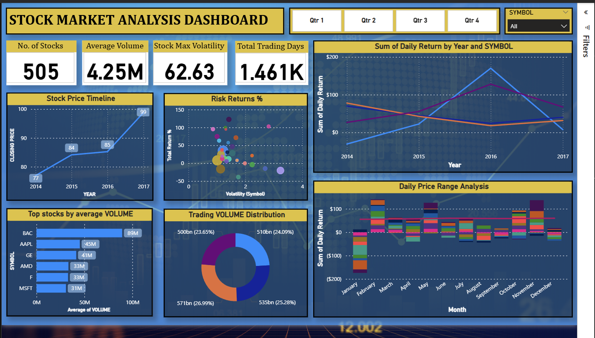

# 📈 Stock Market Analysis Dashboard

An end-to-end Stock Market Analysis project that performs data cleaning, exploratory data analysis (EDA), and visualization on stock price data to generate actionable business insights.

## 🚀 Project Overview

This project focuses on analyzing historical stock price data to:

- Clean and preprocess raw stock datasets
- Perform exploratory data analysis (EDA)
- Identify trends and patterns in stock performance
- Generate insights using data visualization
- Build an analytical dashboard for better decision-making

The goal of this project is to simulate a real-world financial analytics workflow used in investment firms and financial institutions.

---
## 📊 Dataset Description

The dataset contains historical stock market data including:

- Date
- Open Price
- High Price
- Low Price
- Close Price
- Volume
- Other relevant financial indicators

Two datasets are included:

1. **Raw Dataset** → `Stock Prices Data Set.csv`
2. **Cleaned Dataset** → `cleaned_StockPrices.csv`

---

## 🛠️ Technologies Used

- **Python**
- **Pandas** – Data Cleaning & Manipulation
- **NumPy** – Numerical Computation
- **Matplotlib / Seaborn** – Data Visualization
- **Jupyter Notebook / VS Code**

---

## 🔎 Project Workflow

### 1️⃣ Data Collection
- Imported raw stock dataset.

### 2️⃣ Data Cleaning
- Handled missing values
- Removed duplicates
- Corrected data types
- Standardized column formats

### 3️⃣ Exploratory Data Analysis (EDA)
- Trend analysis of stock prices
- Volume analysis
- Price volatility analysis
- Time-series visualization

### 4️⃣ Dashboard / Visualization
- Line charts for stock price movement
- Volume comparison graphs
- High vs Low price trends
- Market behavior analysis

---

## 📈 Key Insights

- Identified upward/downward market trends
- Observed volatility patterns in stock prices
- Analyzed trading volume fluctuations
- Detected potential investment signals

---

## 💡 Business Use Case

This dashboard can help:

- Investors analyze stock performance
- Traders identify entry/exit points
- Financial analysts monitor market trends
- Businesses evaluate market conditions

---

